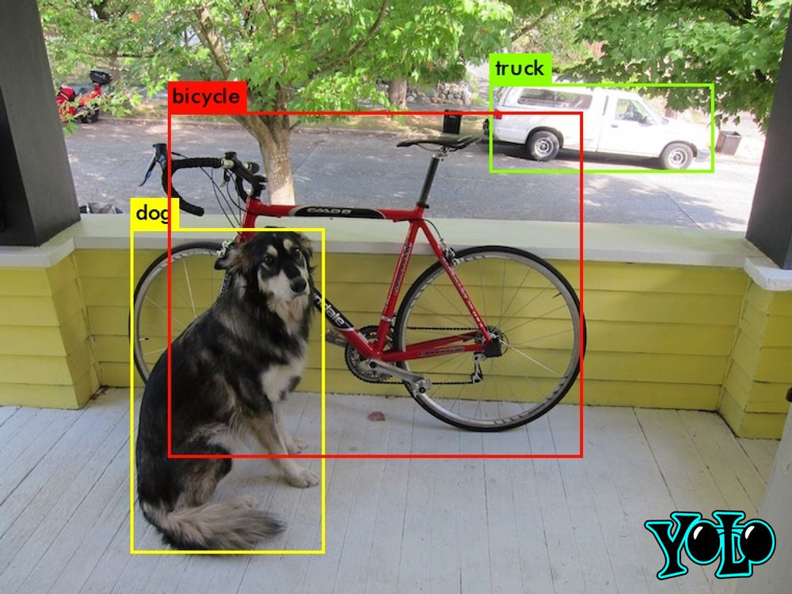

# 🚀 Detecção de Objetos com YOLOv3

Projeto desenvolvido como desafio prático para aplicar **Transfer Learning** com **YOLOv3** em um dataset customizado.  
O objetivo foi treinar, testar e validar uma rede de detecção de objetos, gerando bounding boxes sobre as imagens de entrada.


## 📂 Estrutura do Repositório
```
yolo-bairesdev-dio/
│
├── cfg/                  # Arquivos de configuração (.cfg)
├── data/                 # Dataset, .names, .data, train.txt, test.txt
│   ├── obj/              # imagens + labels
│   ├── obj.data
│   ├── obj.names
│   ├── train.txt
│   ├── test.txt
│
├── backup/               # Pesos treinados (.weights)
│   └── yolov3_custom_final.weights
│
├── results/              # imagens com bounding boxes (predictions.jpg)
│
├── notebook.ipynb        # notebook do Colab
├── README.md             # explicação do projeto
```

# 🚀 Detecção de Objetos com YOLOv3

Este projeto foi desenvolvido como parte de um desafio prático de Deep Learning.  
O objetivo foi aplicar **Transfer Learning** usando o **YOLOv3** para treinar um modelo de detecção de objetos em um dataset customizado, validando sua performance e gerando bounding boxes em imagens de teste.

## ⚙️ Como Executar

1. Clone este repositório:
   ```bash
   git clone https://github.com/seuusuario/yolov3-detection.git
   cd yolov3-detection

2. Abra o arquivo notebook.ipynb no Google Colab.

3. Execute as células do notebook para:

  * Clonar e compilar o Darknet
  * Configurar o dataset (obj.data, obj.names, train.txt, test.txt)
  * Treinar o modelo usando pesos pré-treinados (darknet53.conv.74)
  * Testar o modelo em imagens de validação
  * Gerar predições salvas na pasta results/

📊 Resultados

Após o treinamento, o modelo foi capaz de detectar objetos e marcar suas posições com bounding boxes.

Exemplo de saída após a predição:




✅ Conclusão

O desafio permitiu colocar em prática conceitos importantes de Transfer Learning e Redes de Detecção, passando por todas as etapas:

* Preparação e rotulagem de dataset
* Ajuste de configuração para novas classes
* Treinamento com pesos pré-treinados
* Testes e validação do modelo

Mesmo com um treinamento reduzido no Colab (para fins de entrega), foi possível comprovar a eficácia do pipeline YOLOv3.
Para melhores resultados, recomenda-se treinos mais longos e datasets maiores.

👩‍💻 Autor

Projeto desenvolvido por Enaile Lopes.
Este repositório faz parte do desafio proposto no Bootcamp BairesDev - DIO.
